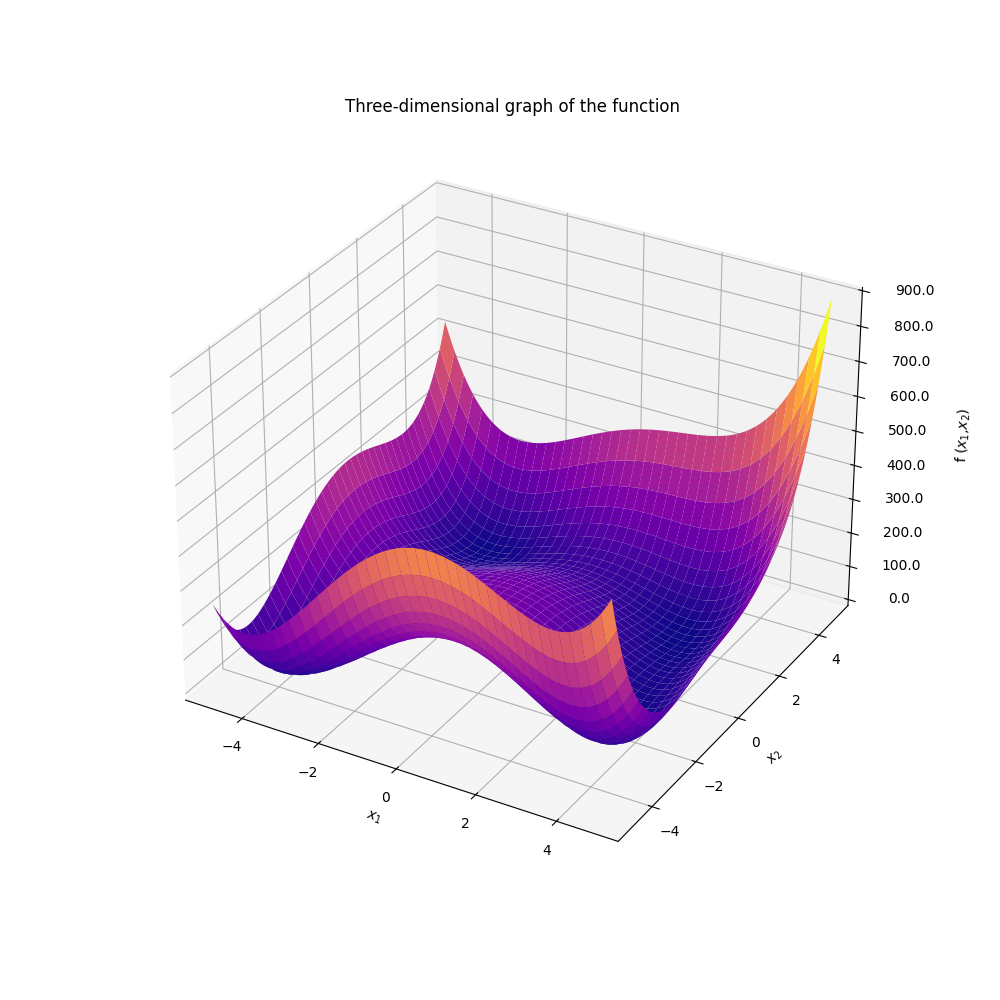
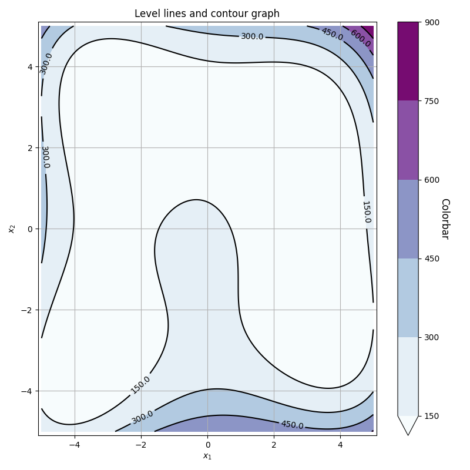
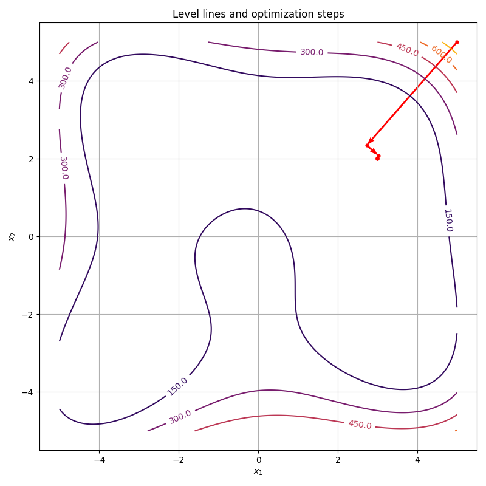

# Методы оптимизации

##  Описание проекта:
Требуется написать модуль для поиска минимумов функций с применением методов оптимизации для одной и нескольких переменных.

## Содержимое 📂
- `main.py` - тестирование работы модуля
- `GradientOptimization.py` — модуль, в котором реализована функция для проведения многомерной оптимизации
- `LinearMinimize.py` —  модуль, в котором реализованы методы одномерной минимизации
- `PlotFunc.py` - модуль, в котором реализованы функции для построения графиков
- `requirements.txt` — зависимости проекта
- `Images/` - примеры визуализаций

## Цели проекта :dart::
* Написать модуль и протестировать его на контрольном примере.
* Использовать различные методы многомерной и одномерной оптимизации.

## Заключение по итогам проекта:
1. Построен модуль для поиска минимума функций.
2. Протестирована его работа на функции Химмельблау.
3. Корректно определены минимумы на тестовой функции для различных начальных точек.
4. Реализованы методы многомерной оптимизации:
  * Градиентный спуск
  * Три варианта метода сопряженных градиента (используются различные коэффициенты)
5. Реализованы методы одномерной оптимизации:
  * Метод дихотомии
  * Метод золотого сечения
  * Метод Голдштейна-Армихо

## Примеры визуализаций проекта:

   
  <b>Функция Химмельблау</b>

  <!-- небольшой отступ между картинками -->

   
  <b>Линии уровня</b>

  <!-- небольшой отступ между картинками -->

   
  <b>Шаги оптимизации</b>

## Использованные инструменты и языки:
* Python
* Numpy
* Matplotlib

## Направления деятельности:
* Методы оптимизации
